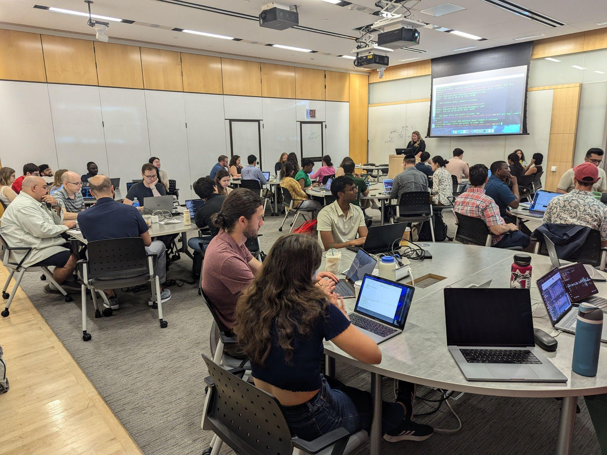
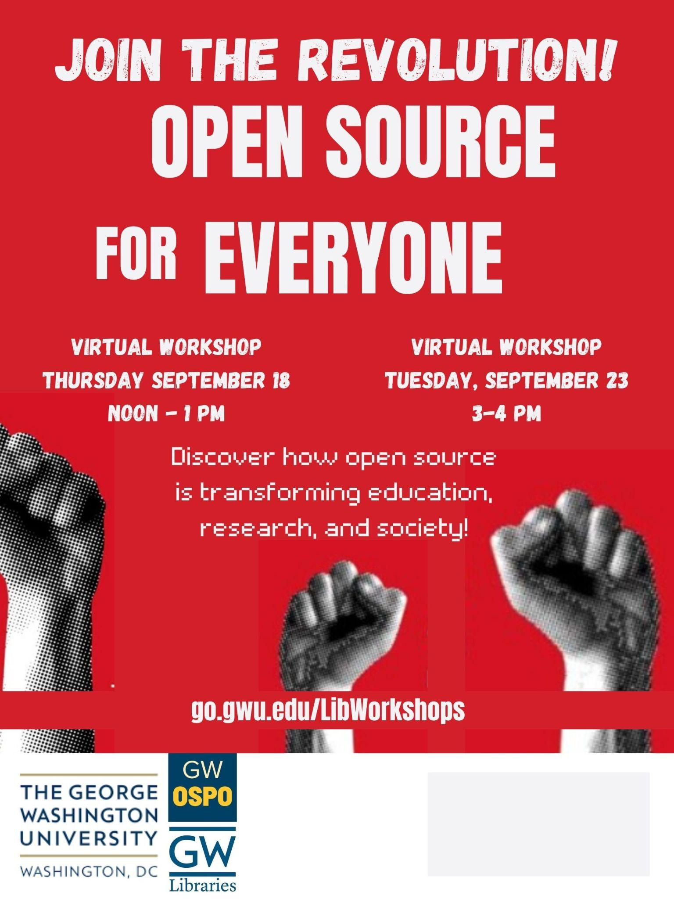







[Nava Open Source Summit]{.large}

# 

 

[]{.large}

---





# 01 Introduction

---

[01. Introduction]{.kicker}

# GW Open Source Program Office (OSPO)

:::: {.two-col}
::: {}
**Based in the Library:** Serving all GW students, faculty, staff, & researchers.

**Mission:** The OSPO fosters a culture of open collaboration by supporting researchers, educators, and students in using and developing open-source software, open data, and open access practices

**Website:** <https://ospo.gwu.edu/>

**Email:** <ospo@gwu.edu>
:::
::: {}
{fig-align="center" width="95%"}
[OSPO Research Workshop (Summer 2024)]{.caption}
:::
::::

---

# GW OSPO Focus

:::: {.two-col}
::: {.card}
### Education

- What is open source?
- How do I make research outputs public?
- Can open source help me get a job?
:::
::: {.card}
### Community Building

Cross discipline GW connections

**Local partners**

- Nava
- Civic Tech DC
- CMS

**Global partners**

- CURIOSS
- CHAOSS
- Open Forum for AI
- United Nations
:::
::::

---

[01. Introduction]{.kicker}

# GW OSPO Events

:::: {.two-col}
::: {.small}

- GW OSCON - March 31-April 1 2027
- GW Coders Lunch & Learn - Wed 11:30am
- Hackathons
- Halloween Robot Challenge

:::
::: {}
{fig-align="center" height="560"}
:::
::::

---
[01. Introduction]{.kicker}

# GW OSPO Services

:::: {.two-col}
::: {.small}

- Consultations
- Workshops
- Grant Support

:::
::: {}
{fig-align="center" height="560"}
:::
::::

---

[01. Introduction]{.kicker}

# GW OSPO Initiatives

:::: {.two-col}
::: {.small}

- Project Registry
- Student Awards Programs
- Capstones, Internships, Collaborations, & Research
- UN SDG working group, Open Forum for AI, CURIOSS Academic OSPO Network
:::
::: {}
{fig-align="center" height="560"}
:::
::::

---





# 02 How are we using AI?

---

[02. How are we using AI?]{.kicker}

# AI design skills review process

---

[02. How are we using AI?]{.kicker}

# AI impact to maintaining open source

---

[02. How are we using AI?]{.kicker}

# AI Research

- Open Forum for AI
- Trustworthy AI
- AI & Quarto

---

[02. How are we using AI?]{.kicker}

# AI popup museum

---






# Thank you
